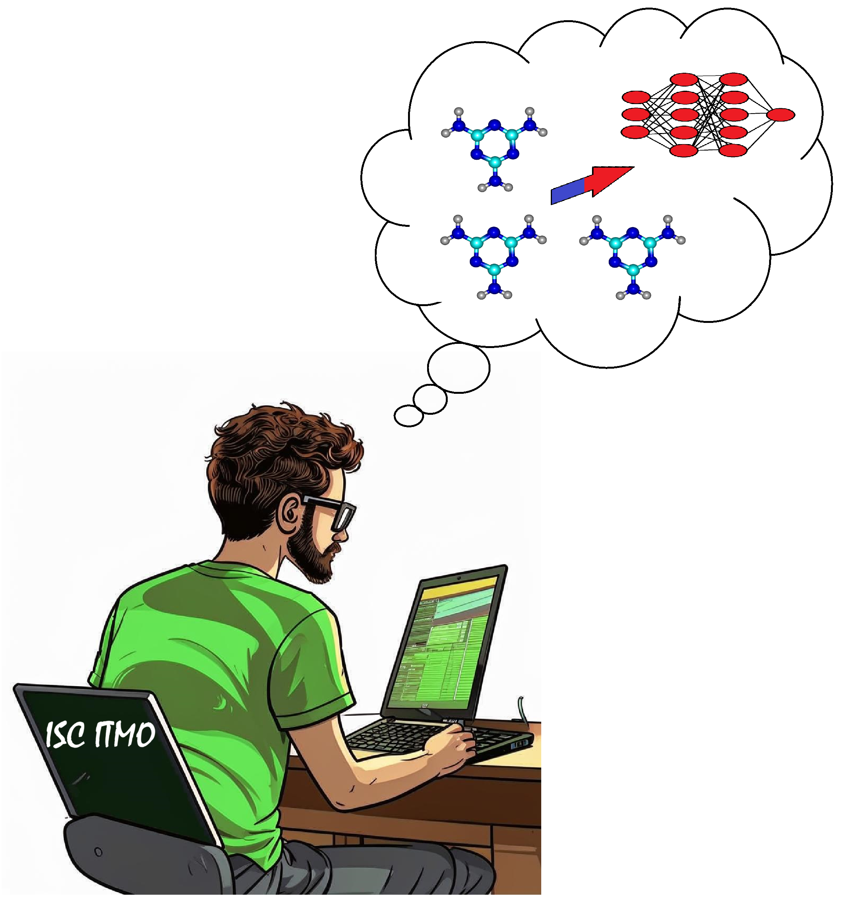

# Follow the link to download the Manual
https://books.ifmo.ru/book/2745/Practice-Oriented_Introduction_to_Machine_Learning_:_Linear_Regression%2C_Decision_Tree%2C_and_Single_Layer_Perceptron_models_:_uchebno-metodicheskoe_posobie..htm 

# Dataset description

The data represents the energy values of supramolecular systems, which were calculated using two different Quantum Chemical approximations. The "HF" (Hartree-Fock) set was calculated using a fast but inaccurate approximation, while "DFT" (Density Functional Theory) was calculated using accurate yet time-consuming approximation.

Feature  | Feature Type | Description
-------------------|--------------------|--------------------
dft_gibbs_free_energy_ev       |Target| Gibbs free energy of the supramolecular system, calculated using the DFT approximation 
dft_electronic_energy_ev       |Target| Electronic energy of the supramolecular system, calculated using the DFT approximation
dft_entropy_ev       |Target| Entropy of the supramolecular system, calculated using the DFT approximation
dft_enthalpy_ev       |Target| Enthalpy of the supramolecular system, calculated using the DFT approximation
hf_gibbs_free_energy_ev       |Training| Gibbs free energy of the supramolecular system, calculated using the HF approximation 
hf_electronic_energy_ev       |Training| Electronic energy of the supramolecular system, calculated using the HF approximation
hf_entropy_ev       |Training| Entropy of the supramolecular system, calculated using the HF approximation
hf_enthalpy_ev       |Training| Enthalpy of the supramolecular system, calculated using the HF approximation

